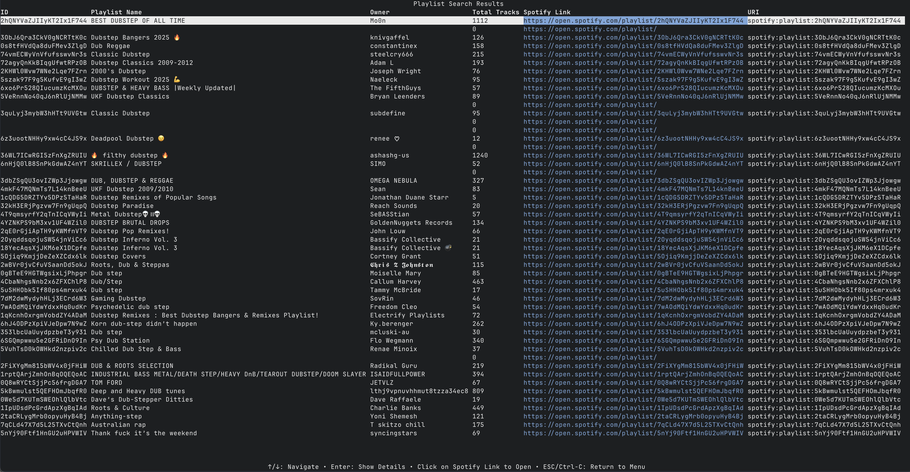
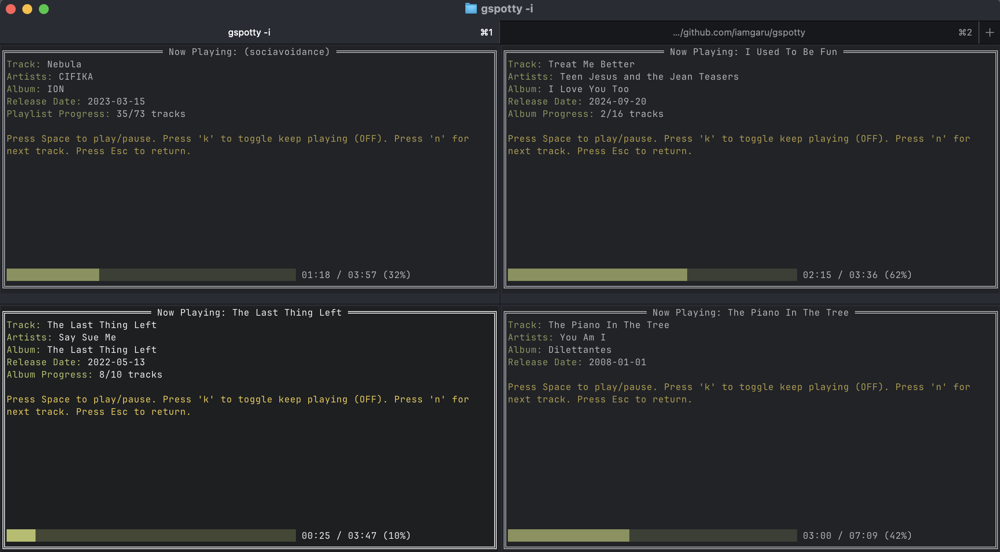
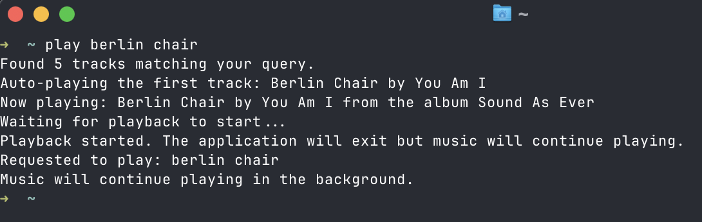

# gspotty

<p align="center">
  
</p>

<p align="center">
  
  <br>
  <em>Searching for dubstep playlists</em>
</p>

<p align="center">
  
  <br>
  <em>Support for multiple players</em>
</p>

<p align="center">
  
  <br>
  <em>Quick play feature in action</em>
</p>

## Table of Contents

- [Project Structure](#project-structure)
- [Features](#features)
- [Building and Testing](#building-and-testing)
  - [Prerequisites](#prerequisites)
  - [Build Commands](#build-commands)
  - [Testing](#testing)
- [Installation](#installation)
- [Usage](#usage)
  - [Authentication](#authentication)
  - [Command Flags](#command-flags)
  - [Examples](#examples)
    - [Basic Search](#basic-search)
    - [Changing Search Type](#changing-search-type)
    - [Additional Options](#additional-options)
    - [Combined Options](#combined-options)
    - [User Profile Lookup](#user-profile-lookup)
- [Interactive Mode](#interactive-mode)
  - [Playing Music](#playing-music)
- [Music Player Controls](#music-player-controls)
  - [Keyboard Controls](#keyboard-controls)
  - [Playback Modes](#playback-modes)
  - [Device Management](#device-management)
- [Output Format](#output-format)
  - [Search Results Display](#search-results-display)
  - [Player Interface](#player-interface)
  - [Error Handling](#error-handling)
- [Notes](#notes)
- [Quick Play Script](#quick-play-script)
  - [Installation](#installation-1)
  - [Usage](#usage-1)
- [License](#license)
- [Author & Version](#author--version)

A simple command-line interface for searching and playing Spotify tracks, albums, and playlists.

## Project Structure

```
gspotty/
├── assets/
│   └── images/          # Application images and screenshots
├── cmd/
│   └── gspotty/          # Main application entry point
├── internal/
│   ├── cli/             # CLI implementation and Spotify client integration
│   ├── config/          # Configuration management
│   ├── menu/            # Interactive menu implementation
│   ├── player/          # Music player implementation
│   ├── profile/         # User profile functionality
│   ├── testutils/       # Test utilities and mocks
│   ├── ui/              # UI components
│   └── utils/           # Utility functions
├── scripts/             # Convenience scripts
│   └── play            # Script for quick music playback
├── configs/             # Configuration files
├── Makefile            # Build and test automation
├── go.mod              # Go module definition
├── go.sum              # Go module checksums
├── LICENSE             # Project license
└── README.md           # Project documentation
```

## Features

- Search for tracks, albums, or playlists
- Display results in a tabular format
- Show detailed information about search results
- Limit the number of results displayed
- Color-coded output for better readability
- Interactive menu mode for easier searching
- Return to menu option after viewing search results
- Simple single-letter flags for easy command usage
- User profile lookup functionality
- Built-in music player with playback controls:
  - Play/Pause
  - Next/Previous track
  - Seek position
  - Volume control
- Keep music playing option even after exiting the player interface
- Support for playlist, search, and album playback modes with next track functionality
- Automatic looping in playlist, search, and album modes when "Keep Playing" is enabled
- Convenience scripts for common operations
- Secure token management with automatic refresh
- Cross-platform support (Linux, Windows, macOS)

## Building and Testing

### Prerequisites

1. Go 1.x or higher
2. Make

### Build Commands

Build the application using Make:
```bash
# Build the binary
make build

# Clean build artifacts
make clean

# Run all tests
make test

# Show available make commands
make help
```

Or build manually:
```bash
go build -o gspotty ./cmd/gspotty
```

### Testing

The project includes comprehensive tests for all components. Run the tests using:

```bash
make test
```

Tests are organized into:
- Unit tests for individual packages
- Integration tests for end-to-end functionality
- Mock implementations for external dependencies (e.g., Spotify API)

## Installation

1. Clone the repository:
   ```
   git clone https://github.com/iamgaru/gspotty.git
   cd gspotty
   ```

2. Build the application:
   ```
   make build
   ```

3. Set up Spotify API credentials:
   ```
   export SPOTIFY_ID=your_client_id
   export SPOTIFY_SECRET=your_client_secret
   ```

4. **Authorization**: The application uses a two-step authentication process:
   - First-time use: You'll be prompted to authorize the application. A browser window will open for you to sign in to Spotify and grant permissions.
   - Subsequent uses: The application will automatically refresh your token using the refresh token.
   - The application securely stores your tokens in your home directory with restricted permissions.

## Usage

```
./gspotty [options]
```

### Authentication

The application uses a combination of authentication flows:
- Client Credentials Flow: For accessing public data (user profiles, search)
- Authorization Code Flow: For controlling playback and accessing private data

Your tokens are securely stored in `~/.spotify_token.json` with restricted permissions (0600).

### Command Flags

| Flag | Description | Default |
|------|-------------|---------|
| `-t` | Type of search: track, album, or playlist | "track" |
| `-q` | Search query | Required |
| `-a` | Artist name to filter results (only for track search) | Optional |
| `-l` | Number of results to display (max 50) | 5 |
| `-d` | Show detailed information about the results | false |
| `-i` | Run in interactive mode with a menu interface | false |
| `-r` | Return to interactive menu after viewing search results | false |
| `-k` | Keep music playing when exiting the player interface | false |
| `-p` | Automatically play the first result and exit | false |
| `-u` | Spotify user ID to look up profile information | Optional |
| `-s` | Stop the currently playing track | false |

### Examples

#### Basic Search

Search for tracks:
```
./gspotty -q "Bohemian Rhapsody"
```

Search for tracks by a specific artist:
```
./gspotty -q "Bohemian Rhapsody" -a "Queen"
```

#### Changing Search Type

Search for albums:
```
./gspotty -t album -q "Dark Side of the Moon"
```

Search for playlists:
```
./gspotty -t playlist -q "workout"
```

#### Additional Options

Limit results to 3:
```
./gspotty -q "Dark Side of the Moon" -l 3
```

Show detailed information:
```
./gspotty -q "workout" -d
```

Run in interactive mode:
```
./gspotty -i
```

Search and return to menu:
```
./gspotty -q "Bohemian Rhapsody" -r
```

Stop the currently playing track:
```
./gspotty -s
```

Play music and keep it playing when exiting the player:
```
./gspotty -q "Bohemian Rhapsody" -k
```

Automatically play the first result:
```
./gspotty -q "Bohemian Rhapsody" -p
```

Automatically play the first result and continue playing after exit:
```
./gspotty -q "Bohemian Rhapsody" -p -k
```

#### Combined Options

Search for Queen albums with detailed information:
```
./gspotty -t album -q "Queen" -d
```

Search for workout playlists, limit to 10, and show details:
```
./gspotty -t playlist -q "workout" -l 10 -d
```

#### User Profile Lookup

Look up a Spotify user's public profile:
```
./gspotty -u spotify
```

## Interactive Mode

When running in interactive mode, the application presents a user-friendly form where you can:

1. Select the search type (track, album, or playlist)
2. Enter your search query
3. Specify an artist name (for track searches)
4. Set the number of results to display (1-50)
5. Choose whether to show detailed information

After submitting the form, the search results will be displayed in the same tabular format as the non-interactive mode.

The interactive interface supports both keyboard navigation and mouse input:
- Use arrow keys or mouse to navigate through results
- Click on Spotify links to open them in your browser
- Click buttons to perform actions
- Use keyboard shortcuts for quick access to common functions

### Playing Music

In interactive mode, you can play music by:

1. Searching for tracks (choose "track" as the search type)
2. Selecting a track from the search results
3. Clicking "Play" on the track details screen

You'll then be taken to the player interface where you can control playback.

## Music Player Controls

The player interface provides a rich set of controls for managing playback:

### Keyboard Controls

| Key | Function |
|-----|----------|
| Space | Play/Pause the current track |
| k | Toggle "Keep Playing" mode (ON/OFF) |
| n | Play next track (in playlist, search, or album mode) |
| p | Play previous track (in playlist, search, or album mode) |
| → | Seek forward 10 seconds |
| ← | Seek backward 10 seconds |
| ↑ | Increase volume |
| ↓ | Decrease volume |
| Esc | Return to the previous menu |

### Playback Modes

The player supports three distinct playback modes:

#### Playlist Mode
- Automatically enabled when playing from a playlist
- Maintains playlist order
- Supports next/previous track navigation
- Loops back to beginning when "Keep Playing" is enabled

#### Search Mode
- Enabled when playing from search results
- Maintains search result order
- Supports next/previous track navigation
- Loops back to beginning when "Keep Playing" is enabled

#### Album Mode
- Enabled when playing from an album
- Maintains album track order
- Supports next/previous track navigation
- Loops back to beginning when "Keep Playing" is enabled

### Device Management

The player automatically:
- Detects available Spotify devices
- Uses the active device if available
- Falls back to the first available device if no active device is found
- Displays device status in the player interface

## Output Format

The application uses a terminal-based UI with the following features:

### Search Results Display
- Color-coded output for better readability
- Tabular format with sortable columns
- Detailed view option with additional track/album/playlist information
- Interactive selection with mouse and keyboard support

### Player Interface
- Real-time progress bar
- Current track information
- Playback controls
- Device status
- Volume indicator
- "Keep Playing" status

### Error Handling
- Clear error messages for common issues
- Device availability warnings
- Authentication error handling
- Network error recovery

## Notes

- The application requires an active Spotify device (desktop app or web player)
- Playback controls require proper device authorization
- Token refresh is handled automatically
- The application uses secure token storage with restricted file permissions
- Rate limiting is handled gracefully with appropriate error messages
- The application supports both mouse and keyboard interaction
- Podcast episodes in playlists are skipped during playback

## Quick Play Script

For a more convenient way to play music, you can use the included "play" bash script:

### Installation

1. Make the script executable:
   ```
   chmod +x play
   ```

2. Move it to a directory in your PATH (optional):
   ```
   sudo mv play /usr/local/bin/
   ```

### Usage

Simply run the script followed by your search query:
```
play Bohemian Rhapsody
```

This is equivalent to:
```
./gspotty -t track -q "Bohemian Rhapsody" -p -k
```

The script will:
1. Search for the specified track
2. Automatically play the first match (-p flag)
3. Continue playing even after exiting (-k flag)
4. Display a confirmation message

The script is a convenient shorthand when you just want to quickly play a song without interacting with the search results.

## License

This project is licensed under the MIT License - see the [LICENSE](LICENSE) file for details.

## Author & Version

```
+----------------+------------------+
| Author         | Nick Conolly     |
| Version        | 0.2.5            |
| GitHub         | iamgaru          |
+----------------+------------------+
```